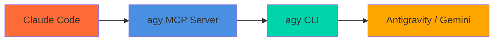

# agy MCP Server

Bridge between Claude and Google **Antigravity's `agy` CLI** — let Claude Code (or any MCP client) drive the Antigravity agent through tool calls.



This project mirrors the architecture of [`codex-mcp-server`](https://github.com/tuannvm/codex-mcp-server) but wraps `agy` instead of `codex`.

## How it works

`agy` exposes a non-interactive **print mode**: `agy -p "<prompt>"` runs a single
prompt (the prompt is the **value of `-p`**) and prints the response to **stdout**.
This server spawns `agy -p "<prompt>"` with the prompt as an argument, always
closes stdin so `agy` never blocks waiting for input, and returns stdout as the
MCP tool result. (`agy` only reads the prompt from stdin when `-p` is empty; a
bare `-p` with no value errors with "flag needs an argument".)

## Requirements

- **`agy` CLI v1.0.3+** on your `PATH` (`agy --version`). It ships with Google Antigravity.
- You must be **logged into Antigravity** — `agy` reuses the desktop app's
  credentials, so there is no API key to configure here.

## Install

> Prerequisite (all methods): the `agy` CLI (v1.0.3+) must be installed and
> logged into Antigravity on the machine that runs the MCP server.

### A) Via GitHub + npx (no manual clone)

```bash
claude mcp add agy-cli -- npx -y github:toonPt0473/agy-mcp-server
```

`npx` clones the repo and runs the `prepare` script (`tsc`) to build `dist/` on
first install, then launches the server. Requires `git` and Node on `PATH`.
Updates: bump the repo; npx re-fetches on the next cold install (or clear the npx cache).

### B) From a local clone

```bash
git clone https://github.com/toonPt0473/agy-mcp-server.git
cd agy-mcp-server
npm install            # runs the build automatically via the `prepare` script
claude mcp add agy-cli -- node "$(pwd)/dist/index.js"
```

### C) Global binary (decoupled from the source folder)

```bash
npm install -g .       # in the cloned repo; exposes the `agy-mcp-server` bin
claude mcp add agy-cli -- agy-mcp-server
```

This repo also ships a project-scoped `.mcp.json` pointing at `dist/index.js`,
which Claude Code picks up automatically when run from the project directory.

## Tools

| Tool | Description |
|------|-------------|
| `agy` | Run a prompt through `agy -p` (print mode) with optional model, session continuation, extra dirs, sandbox, and skip-permissions |
| `models` | List the models available to agy (`agy models`) |
| `listSessions` | View active conversation sessions |
| `ping` | Test server connection |
| `help` | Get `agy --help` output |
| `changelog` | Show `agy` changelog / release notes |

### `agy` tool parameters

| Parameter | Type | Default | Description |
|-----------|------|---------|-------------|
| `prompt` | string | — (required) | The task/question. Passed as the value of `agy -p`. |
| `model` | string | — | Model for this call (`--model`). Use a name from the `models` tool, e.g. `Claude Opus 4.6 (Thinking)`. Omit to use agy's default (or `AGY_MCP_DEFAULT_MODEL`). |
| `sessionId` | string | — | Multi-turn context. First turn = fresh conversation; later turns continue it. |
| `resetSession` | boolean | `false` | Start a fresh conversation for this session. |
| `conversationId` | string | — | Resume a specific agy conversation (`--conversation <id>`). |
| `continueConversation` | boolean | `false` | Force `agy --continue` (most recent conversation). |
| `addDirs` | string[] | — | Extra workspace dirs (`--add-dir`, repeatable). |
| `sandbox` | boolean | `false` | `--sandbox` (terminal restrictions). |
| `skipPermissions` | boolean | `false` | ⚠️ `--dangerously-skip-permissions` — auto-approve all tool use. Needed for agy to run tools unattended. |
| `printTimeout` | string | `5m` | `--print-timeout` (Go duration, e.g. `90s`, `1h30m`). |

## Examples

```
Use agy to explain the auth flow in this repo
Use the models tool to see which agy models are available
Use agy with model "Claude Opus 4.6 (Thinking)" to review this design
Use agy with sessionId "refactor" to analyze this module
Use agy with sessionId "refactor" to now implement the change   # continues the same conversation
Use agy with skipPermissions true and addDirs ["./src"] to refactor and write files
```

## Selecting a model

`agy` v1.0.5+ supports choosing a model. List what's available with the
`models` tool (runs `agy models`), then pass the exact name as the `model`
parameter of the `agy` tool — names contain spaces/parentheses and are passed
safely as a single argument, e.g. `Claude Opus 4.6 (Thinking)` or
`Gemini 3.5 Flash (High)`.

Precedence: per-call `model` arg → `AGY_MCP_DEFAULT_MODEL` env → omitted (agy
uses its own default). An unknown model name is not rejected — `agy` falls back
to its default. Requires `agy` ≥ v1.0.5 (older versions have no `--model` flag).

## Session model & limitations

- `agy` print mode does **not** emit a conversation ID, so multi-turn within a
  `sessionId` uses `agy --continue` (continue the **most recent** conversation).
- Because "most recent" is global to `agy`, avoid interleaving multiple sessions
  or running `agy` manually in the middle of a session — the continuation could
  attach to the wrong conversation. For precise resume, pass a `conversationId`
  you obtained from the Antigravity app.
- Without `skipPermissions: true`, a prompt that makes `agy` want to use a tool
  may block until `printTimeout`, since approvals can't be given non-interactively.
  Use `skipPermissions` for agentic/file-writing tasks; leave it off for Q&A.

## Environment variables

- `AGY_BIN` — path to the `agy` binary (default: `agy` on `PATH`).
- `AGY_MCP_DEFAULT_MODEL` — default `--model` when not set per-call (default: none → agy's own default).
- `AGY_MCP_PRINT_TIMEOUT` — default `--print-timeout` when not set per-call (default `5m`).
- `AGY_MCP_LOG_DIR` — enable conversation logging into this directory (see below).
- `AGY_MCP_LOG_FILE` — enable conversation logging into this single file (overrides `AGY_MCP_LOG_DIR`).
- `STRUCTURED_CONTENT_ENABLED` — emit `structuredContent` in results (`1`/`true`/`yes`/`on`). Off by default; `_meta` is always included for Claude Code.

## Conversation logging

Every `agy` tool call (the prompt Claude sent and the response `agy` returned)
can be appended to a **Markdown transcript**. Logging is **off by default**;
enable it by setting one of:

- `AGY_MCP_LOG_DIR=/path/to/dir` → one file per day: `agy-conversations-YYYY-MM-DD.md`
- `AGY_MCP_LOG_FILE=/path/to/file.md` → a single file (takes precedence)

Set it in the `env` block of your `.mcp.json`, e.g.:

```json
{
  "mcpServers": {
    "agy-cli": {
      "type": "stdio",
      "command": "npx",
      "args": ["-y", "github:toonPt0473/agy-mcp-server"],
      "env": { "AGY_MCP_LOG_DIR": "/abs/path/to/project/.agy-logs" }
    }
  }
}
```

Each entry records the timestamp, mode (fresh/continue/resume), sessionId,
conversationId, duration, flags (sandbox/skipPermissions/addDirs), and the full
prompt and response. Logging failures are reported to stderr but never break the
tool. Add the log directory to `.gitignore` if you don't want transcripts committed.

## Development

```bash
npm install     # install dependencies
npm run dev     # run from source with tsx
npm run build   # compile to dist/
npm test        # run the test suite
npm run lint    # eslint
npm run format  # prettier
```

## License

ISC
